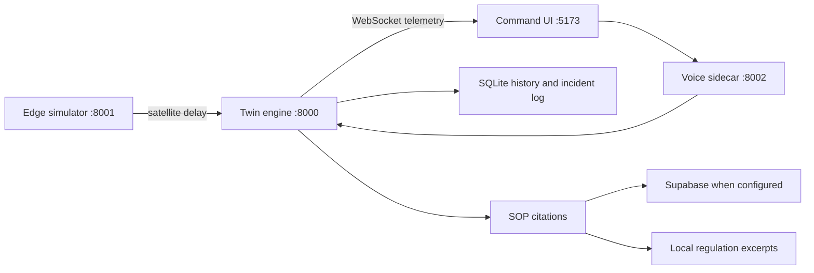

# POLARIS

Closed-loop digital twin for India's Antarctic stations, **Bharati** and **Maitri**, commanded from NCPOR Goa. The edge station simulates first-principles thermal, fuel, and microgrid physics. The twin scores that stream, applies Antarctic SOP rules with citations, and the command UI shows the live station, the fleet, and a spoken brief.

## Architecture



| Service | Port | Role |
|---|---|---|
| Station edge | 8001 | Physics, scenarios, voyage clock |
| Twin engine | 8000 | Ingest, anomaly score, SOP, history |
| Voice | 8002 | Speech, RAG, station orders |
| UI | 5173 | Overview, fleet, analytics, mission control |

## Run

From `polaris/`, three backends and the UI:

```bash
# edge
cd station-mock-server
python -m venv .venv
.venv\Scripts\activate
pip install -r requirements.txt
uvicorn main:app --host 127.0.0.1 --port 8001

# twin
cd twin-backend
python -m venv .venv
.venv\Scripts\activate
pip install -r requirements.txt
uvicorn main:app --host 127.0.0.1 --port 8000

# voice
cd voice-backend
python -m venv .venv
.venv\Scripts\activate
pip install -r requirements.txt
uvicorn main:app --host 127.0.0.1 --port 8002

# ui
cd frontend
npm install
npm run dev
```

Open `http://localhost:5173`.

Optional, in `twin-backend/.env`:

```
SUPABASE_URL=
SUPABASE_KEY=
```

When those are set, SOP cards read `knowledge_chunks` from Supabase. Without them, the same cards use the local regulation excerpts. Telemetry history and the incident log always use SQLite at `twin-backend/data/` (not committed).

On laptops with 8 hardware threads or fewer, the 3D view drops shadows, bloom, HDR lighting, and most of the snow field so the scene stays interactive.

## What to show

- **Overview** — boot line, service pulse, Antarctic route, daily briefing
- **Fleet** — Bharati and Maitri side by side, with the temperature and fuel gap
- **Analytics** — persisted traces, playback scrubber, 24-hour fuel outlook
- **Control** — scenario injection, SOP actions, regulation excerpts, incident log
- **Voice dock** — quick orders and a waveform while Polar is speaking

Background reading: [papers_reading_guide.md](papers_reading_guide.md) and [digital_twin_knowledge_base.md](digital_twin_knowledge_base.md).

Rehearsal steps: [DEMO_SCRIPT.md](DEMO_SCRIPT.md).
